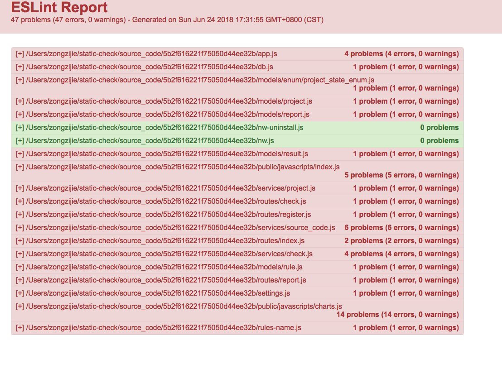

## 先看效果
首页

Git检查

TFS检查

统计

规则列表

eslint报告

## 废话不多说直接上代码
### 下载代码，安装依赖
环境：macOs
依赖：node git mongodb(需要提前安装)
```sh
$ git clone https://github.com/zongzijie/static-code-check.git static-check
Cloning into 'static-check'...
remote: Counting objects: 390, done.
remote: Compressing objects: 100% (28/28), done.
remote: Total 390 (delta 14), reused 36 (delta 10), pack-reused 340
Receiving objects: 100% (390/390), 114.90 KiB | 255.00 KiB/s, done.
Resolving deltas: 100% (204/204), done.
$ cd static-check/
$ npm install
npm ERR! code EBADPLATFORM 
npm ERR! notsup Unsupported platform for node-windows@0.1.14: wanted {"os":"win32","arch":"any"} (current: {"os":"darwin","arch":"x64"})
npm ERR! notsup Valid OS:    win32
npm ERR! notsup Valid Arch:  any
npm ERR! notsup Actual OS:   darwin
npm ERR! notsup Actual Arch: x64

npm ERR! A complete log of this run can be found in:
npm ERR!     /Users/zongzijie/.npm/_logs/2018-06-24T08_52_57_971Z-debug.log
$ 
```
安装NPM依赖时，在非windows平台上会报错（如上），尽管忽略，node-windows 是为了在windows平台上实现windows服务开机自启动所做的优化，可以支持开机自动启动站点服务，但还在测试阶段可能会有bug。
接下来
### 安装 MongoDB
```sh
$ sudo brew install mongodb
```
### 创建 MongoDB 数据库
```sh
$ sudo mkdir -p /data/db
```
### 运行 MongoDB
```sh
$ sudo mongod
```
#### 如果需要支撑TFS仓库的代码检查，还需要安装git-tf
```sh
$ brew install git-tf
```
### 运行站点
```sh
$ node bin/www
```
访问：http://localhost:3000/


### 最后还是要对的起自己，说说做这个平台的初衷
代码这个东西不维护的话，随着时间推移，环境变迁，时代推进，代码是会腐烂变质的。
这个代码检查平台主要是为了工程度量，作为完成标尺的一部分，比如不允许有错误，在某个时间点，问题必须归零，还可以使用自动构建--目前只支持webapi（其实就是直接模拟http客户端调用检查接口，具体使用方法就不多说了，与用户点击开始检查没两样，可以自行模拟）


